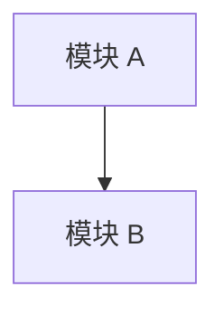

# 系统上下文报告

**生成日期**: {{DATE}}
**分析目标**: {{SCOPE}}

## 执行摘要
> [用一句话总结系统当前状态，例如：“一个总体稳健的 Python 后端，但 Auth 模块存在一定技术债。”]

---

## 1. 组件清单

### 1.1 现有组件
| 组件 | 类型 | 路径 | 描述 |
|---|---|---|---|
| [名称] | [Service/UI/DB] | [路径] | [简要描述] |

### 1.2 缺失组件（暗物质）
> [!WARNING]
> 以下组件当前缺失，但对生产可用性至关重要。

| 组件 | 类别 | 为什么需要 | 缺失影响 |
|---|---|---|---|
| 错误处理 | 基础设施 | 未发现统一错误边界 | 调试将非常困难 |
| 日志 | 可观测性 | 缺少结构化日志 | 线上将失明 |
| 配置管理 | 运维 | 检测到硬编码密钥 | 安全风险 |

---

## 2. 依赖拓扑

### 2.1 构建边界（Build Inspector）
> [插入来自 `build-inspector` 的发现：Build Roots、Topology、Sidecar Warnings]

### 2.2 逻辑耦合（Git Forensics）
> [插入热点矩阵或耦合表]

| 文件 A | 文件 B | 耦合度 | 风险 |
|---|---|---|---|
| auth.py | user_db.py | 85% | HIGH |

---

## 3. 风险与警告

### 3.1 IPC 契约风险（Runtime Inspector）
> [!CAUTION]
> [列出由 `runtime-inspector` 发现的 IPC 接口中契约薄弱或缺失的部分]

### 3.2 上帝模块
> [列出 Ca（传入耦合）过高的模块]

### 3.3 技术债热点
> [列出高变更频率 + 高复杂度的文件]

---

## 4. 隐式约束（Invariant Hunter）

### 4.1 业务不变量
> [永远不能被破坏的规则]
- 订单总额必须 >= 0
- 用户在支付前必须完成邮箱验证

### 4.2 假设
> [代码中存在但未被显式声明的假设]
- “网络总是可靠的”（没有重试逻辑）
- “ID 永远是整数”

### 4.3 硬编码值
- API 密钥
- 超时值

---

## 5. 概念模型（Concept Modeler）

### 5.1 统一语言
| 术语 | 定义 |
|---|---|
| 用户 | 已注册的终端用户（不是管理员） |
| 订单 | 一次购买请求 |

### 5.2 数据流
> [描述关键流程]

---

## 6. 人类检查点
> [!IMPORTANT]
> 在进入 Blueprint 阶段前，请确认以下事项：

- [ ] 组件清单是否完整？
- [ ] 当前识别出的风险是否可接受？
- [ ] 所有不变量是否都已捕获？
