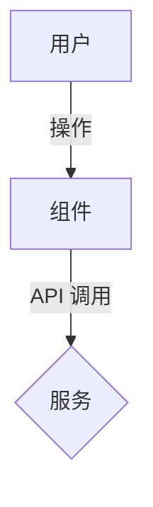

# 技术设计说明（RFC / 技术规格）

**PRD 参考**: [链接到 PRD]
**功能名称**: [功能名称]
**状态**: 草稿

## 1. 高层设计
### 架构图（Mermaid）
<!-- 使用 Mermaid 展示数据流 -->


### 组件层级
*   `父组件`
    *   `子组件A`（Props: x, y）
    *   `子组件B`（State: z）

## 2. API 契约（接口签名）
<!-- 关键：定义精确签名。禁止幻觉。 -->

### 接口端点
*   `POST /api/v1/resource`
    *   **请求体**：
        ```typescript
        interface CreateRequest {
          field: string; // 必填
        }
        ```
    *   **响应**：`200 OK`（Schema 见下）

### 函数接口
<!-- 关键内部函数签名 -->
```typescript
function calculateSomething(input: InputType): ResultType
```

## 3. 数据模型策略
### 数据库 Schema 变更
```sql
-- 在这里填写 DDL
CREATE TABLE ...
```

### 状态管理
*   全局状态：[例如 Redux / Zustand slice]
*   本地状态：[例如 React.useState]

## 4. 实施步骤
<!-- 原子化、按顺序的实施步骤 -->
1.  [步骤 1：数据库迁移]
2.  [步骤 2：后端 API]
3.  [步骤 3：前端界面]

## 5. 安全与风险
*   **认证**：[如何保证访问安全？]
*   **校验**：[使用什么输入校验方案？]
